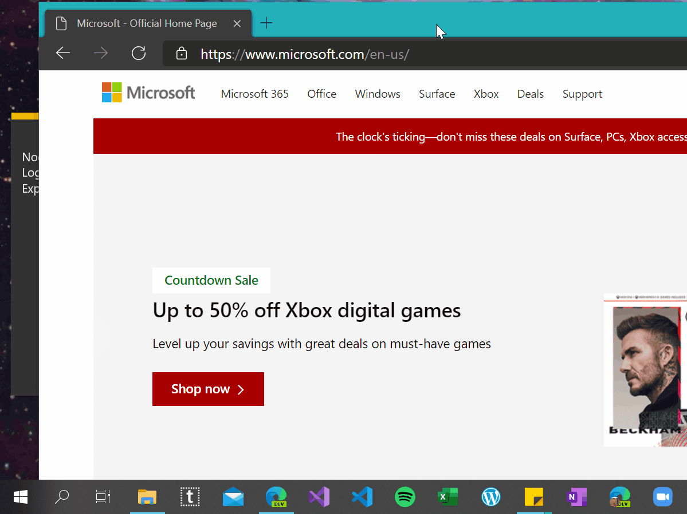

# Text-Grab

This is a minimal Windows utility which makes all visible text available for copy and paste. 

Too often there is text on the screen but it is unable to be selected. This happens when text is saved in an image, in a video, or the text within an application. 

The OCR is done locally by [Windows 10 API](https://docs.microsoft.com/en-us/uwp/api/Windows.Media.Ocr). This enables Text Grab to have essentially no UI and not require a constantly running background process.

## Two Use Cases

The first use case is the most obvious, selecting a region of the screen and the text within the selected region will be added to the clipboard.

The second use case takes a single click and attempts to copy the word which was clicked on. This is enabled because the Windows 10 OCR API draws a bounding box around each recognized word. 

If the click point or selected region has no text in it the Text Grab window stays active. To exit the application, press the escape key, or Alt+F4.

### Principles
Text Grab is designed to be as minimal and quick as possible. By using Windows 10’s OCR capabilities Text Grab can launch quickly without needing to run in the background. Pinning Text Grab to the Taskbar enables launching via keyboard shortcut. 
There is no history, or dialog box, or feedback. This tool is designed to be used hundreds of times a day. Reducing clicks and menus means saving time, which is the primary focus of Text Grab. 
### Thanks for using Text Grab
Hopefully this simple app makes you more productive and saves you time from transcribing text.
If you have any questions or feedback reach out on Twitter [@TheJoeFin](www.twitter.com/thejoefin) or by email joe@textgrab.net
