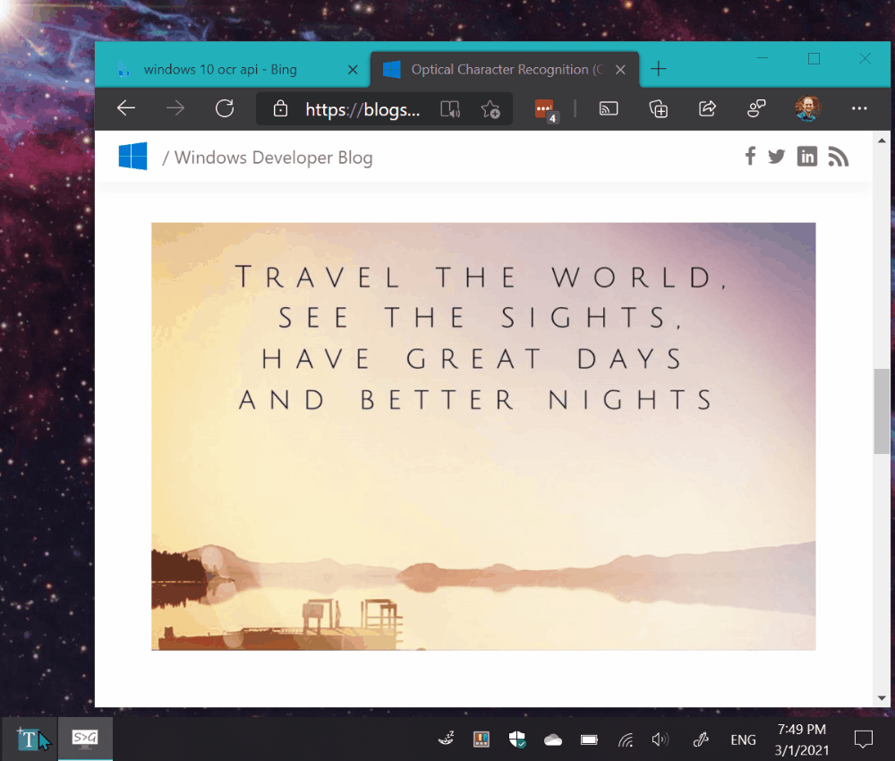
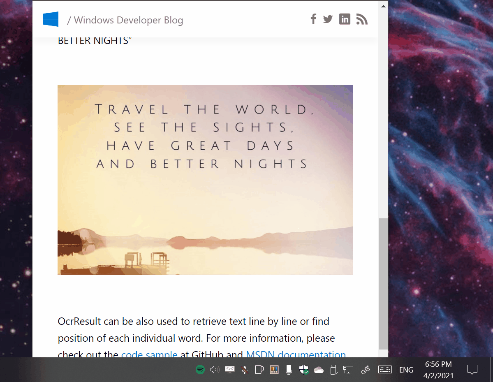

# Text-Grab

This is a minimal Windows utility which makes all visible text available for copy and paste. 

Too often there is text on the screen but it is unable to be selected. This happens when text is saved in an image, in a video, or the text within an application. 

The OCR is done locally by [Windows 10 API](https://docs.microsoft.com/en-us/uwp/api/Windows.Media.Ocr). This enables Text Grab to have essentially no UI and not require a constantly running background process.

## How to Build
Get the code:

- git clone https://github.com/TheJoeFin/Text-Grab.git

### With Visual Studio 2019 or 2022
- Install the Visual Studio (the free community edition is sufficient).
    - Install the "Universal Windows Platform Development" workload.
    - Install the ".NET desktop development" workload.
    - Install ".NET cross-platform development" toolset
    - Install Windows 10 SDK (10.0.17763.0)
    - Install Windows 10 SDK (10.0.18362.0)
    - Install Windows 10 SDK (10.0.19041.0)
- Open Text-Grab\Text-Grab.sln in Visual Studio.
- Set Text-Grab-Package as Startup Project
- Set CPU Target to x86
- Key F5 or Press "▶ Local Machine"

### With Visual Studio Code (VS Code)
- Install Visual Studio Code https://code.visualstudio.com/
- Install .NET 3.1 SDK https://dotnet.microsoft.com/download/dotnet/3.1
- Open Text-Grab\Text-Grab Folder in VS Code
- Run terminal commands:
    - dotnet restore
    - dotnet build 

> Note: running Text Grab from VS Code does not launch native Window notifications

## Text Grab works in Three Modes

### Full Screen Mode

The first full screen use case is the most obvious, selecting a region of the screen and the text within the selected region will be added to the clipboard.

The second use case takes a single click and attempts to copy the word which was clicked on. This is enabled because the Windows 10 OCR API draws a bounding box around each recognized word. 

If the click point or selected region has no text in it the Text Grab window stays active. To exit the application, press the escape key, or Alt+F4.

### Grab Frame Mode

Grab frame is a mostly transparent frame with a search bar and Grab button. The Grab Frame can be positioned wherever you want to copy the text. This can be done by searching for text, clicking on a word border, and/or clicking on the Grab button.

The underlying OCR technology is the same as the full screen mode and has all of the same benefits and drawbacks. Since Text Grab is using OCR the recognition is not perfect. However, adjusting the size and position of the window does affect the OCR's accuracy.

## Principles
Text Grab is designed to be as minimal and quick as possible. By using Windows 10’s OCR capabilities Text Grab can launch quickly without needing to run in the background. Pinning Text Grab to the Taskbar enables launching via keyboard shortcut. 
There is no history, or dialog box, or feedback. This tool is designed to be used hundreds of times a day. Reducing clicks and menus means saving time, which is the primary focus of Text Grab. 
### Thanks for using Text Grab
Hopefully this simple app makes you more productive and saves you time from transcribing text.
If you have any questions or feedback reach out on Twitter [@TheJoeFin](http://www.twitter.com/thejoefin) or by email joe@textgrab.net
