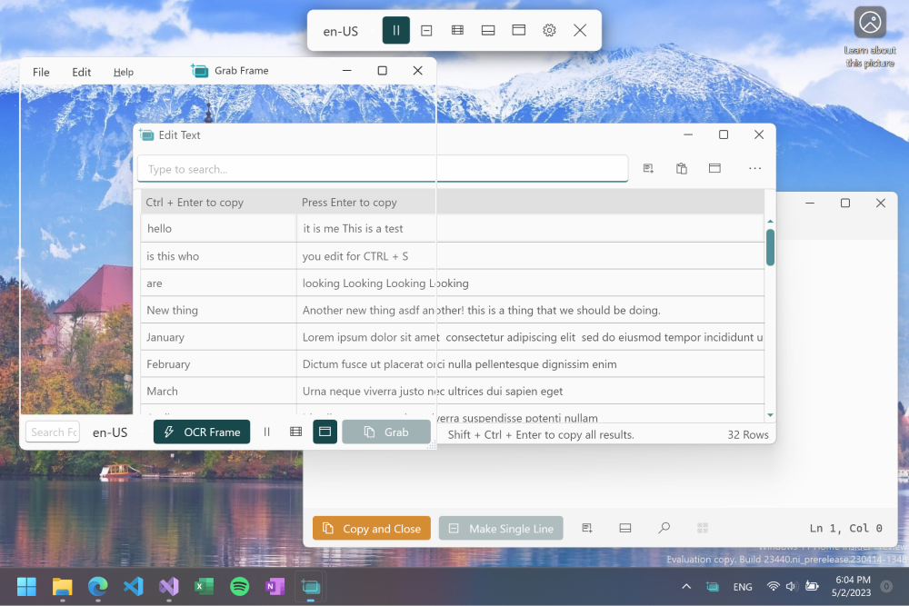
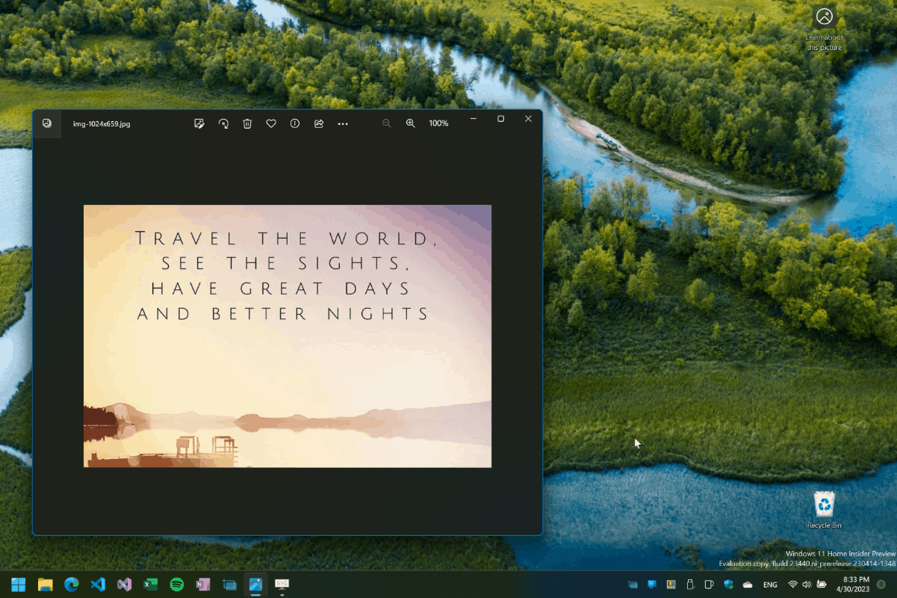
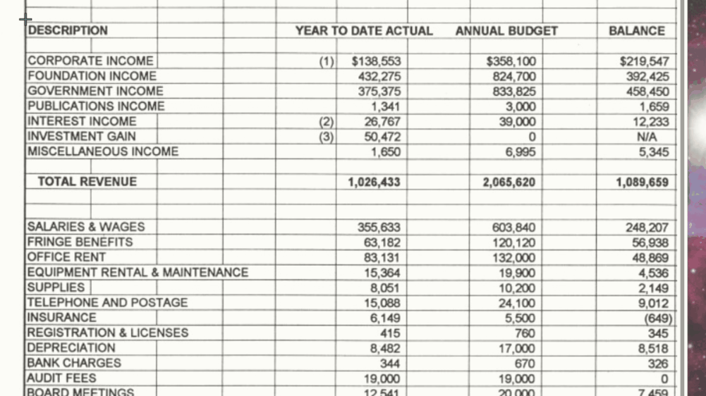
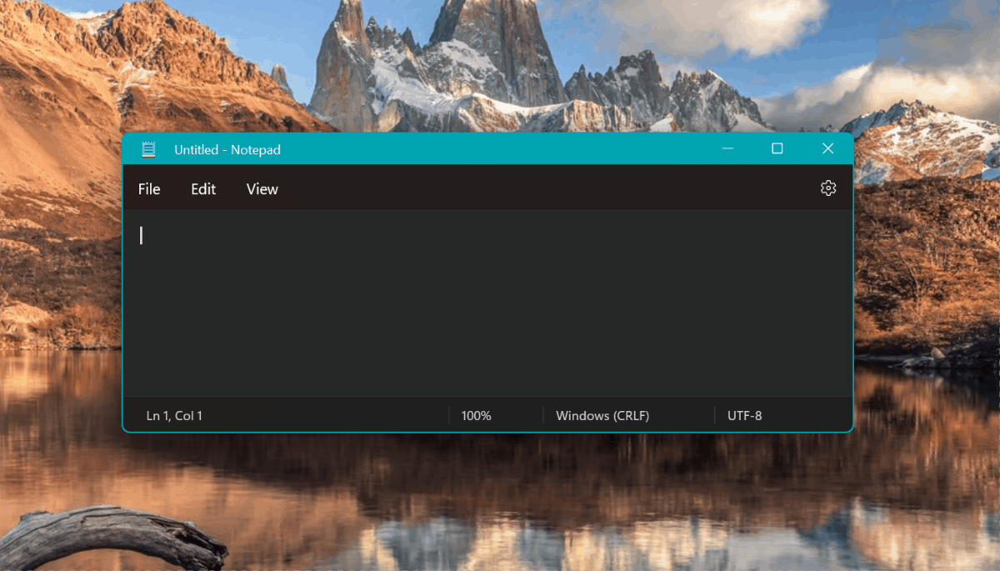

  

<h1 align="center">
  Text Grab
</h1>

  Copy any text you can see.

  

### Overview

This is a minimal optical character recognition (OCR) utility for Windows 10/11 which makes all visible text available to be copied. 

Too often text is trapped within images, videos, or within parts of applications and cannot be selected. Text Grab takes a screenshot, passes that image to the OCR engine, then puts the text into the clipboard for use anywhere. The OCR is done locally by [Windows API](https://docs.microsoft.com/en-us/uwp/api/Windows.Media.Ocr). This enables Text Grab to have essentially no UI and not require a constantly running background process. Working with text can be much more than just copying text from images, so Text Grab has a range of different modes to make working with text fast and easy. 

I am the author of the [PowerToy Text Extractor](https://learn.microsoft.com/en-us/windows/powertoys/text-extractor). The Full-Screen Grab mode of this app was the basis of that PowerToy

## How to Install

### Official

- [Microsoft Store](https://www.microsoft.com/en-us/p/text-grab/9mznkqj7sl0b?cid=TextGrabGitHub)
- [GitHub Releases](https://github.com/TheJoeFin/Text-Grab/releases/latest)

### Community

- [scoop](https://scoop.sh/) — `scoop install text-grab`
- [choco](https://community.chocolatey.org) - `choco install text-grab`

## How to Build
Get the code:
- Install git: https://git-scm.com/download/win
- git clone https://github.com/TheJoeFin/Text-Grab.git

### With Visual Studio 2019 or 2022
- Install the Visual Studio (the free community edition is sufficient).
    - Install the "Universal Windows Platform Development" workload.
    - Install the ".NET desktop development" workload.
    - Install ".NET cross-platform development" toolset
    - Install Windows 10 SDK (10.0.19041.0)
- Open `\Text-Grab\Text-Grab.sln` in Visual Studio.
- Set Text-Grab-Package as Startup Project
- Set CPU Target to x86 or x64
- Key F5 or Press "▶ Local Machine"

### With Visual Studio Code (VS Code)
- Install Visual Studio Code https://code.visualstudio.com/
- Install .NET 6.0 SDK https://dotnet.microsoft.com/download/dotnet/6.0
- Open `\Text-Grab\` Folder in VS Code (Same folder as .sln file)
- Key F5 to launch with debugger

## Text Grab has Four Modes

### 1. Full-Screen Mode (basis of [Text Extractor](https://learn.microsoft.com/en-us/windows/powertoys/text-extractor))

The first full screen use case is the most obvious, selecting a region of the screen and the text within the selected region will be added to the clipboard.

The second use case takes a single click and attempts to copy the word which was clicked on. This is enabled because the Windows 10 OCR API draws a bounding box around each recognized word. 

If the click point or selected region has no text in it the Text Grab window stays active. To exit the application, press the escape key, right-click and choose cancel, or Alt+F4.

### 2. Grab Frame Mode

Grab frame is mostly a transparent frame with a search bar and Grab button. The Grab Frame can be positioned wherever you want to copy the text. This can be done by searching for text, clicking on a word border, and/or clicking on the Grab button.

The underlying OCR technology is the same as the full screen mode and has all of the same benefits and drawbacks. Since Text Grab is using OCR the recognition is not perfect. However, adjusting the size and position of the window does affect the OCR's accuracy.

### 3. Edit Text Window

Similar to Notepad, the Edit Text Window is a "Pure Text" editing experience, with no formatting. This means copying text into or out of the Window will remove all formatting, but linebreaks and tabs will remain. Gather text using Full Screen Grabs or Grab Frames.

There are several tools with in the Edit Text Window which make it quick and easy to fix or change text.
- List files and folders in chosen directory
- Watch clipboard for changes
- Make text into a single line
- Toggle between UPPERCASE, lowercase, and Titlecase
- Trim spaces and empty lines
- Isolate selected text
- Replace reserved characters (like spaces, /, %, etc.)
- Find and replace
- Extract regular expressions
- Remove duplicate lines
- Convert stacked data to table format
- Copy text from every image in a folder
- Launch URLs
- And more!

### 4. Quick Simple Lookup

This mode of Text Grab is not about OCR, but instead it is about retreiving frequently used text. Think of Quick Simple Lookup as your long term memory. Use it to store frequently used URLs, emails, part numbers, etc. Basically a custom dictionary you can edit and recall instantly at any time. The workflow for Quick Simple Lookup is designed to be fast and functional, here is how it works.

1. Press the hotkey (Default is Win + Shift + Q)
2. Begin typing to filter the lookup to the item you want
3. When what you want is the first result, press enter
4. Then paste the value you just copied into the application you are using

### Bonus. Command Line Interface

Arguments
- `Fullscreen` launches into Fullscreen Grab mode
- `GrabFrame` launches a new Grab Frame
- `EditText` launches a new Edit Text Window
- "Settings` opens Text Grab settings
- `"file path"` Text Grab will open the file if it is a Text file, but if it is an image file it will OCR the file and place the results into a new Edit Text Window.
- `"folder path"` e.g. `.\Text-Grab.exe "C:\Users\myPC\Downloads"` Text Grab will launch a new Edit Text Window and scan all images in that directory.

## Principles
Text Grab is designed to have multiple modes, from minimal to fully featured; all focused on productivity. By using Windows 10’s OCR capabilities Text Grab can launch quickly without needing to run in the background. Pinning Text Grab to the Taskbar enables launching via keyboard shortcut. Now with version 2.4 when the background process is enabled Text Grab can be activated from anywhere using global hotkeys. The full-screen mode is designed to be used hundreds of times a day. Reducing clicks and menus means saving time, which is the primary focus of Text Grab. The Grab Frame tool can be positioned on top of any text content for quick OCR any time. When it comes to manipulating the text you've copied the Edit Text Window offers a wide range of tools to speed up common tasks and take the raw text into clean usable content.

### Packages Used
- ZXing.Net - Barcode and QR Code scanning: https://github.com/micjahn/ZXing.Net
- WPF UI - Fluent UI Style: https://github.com/lepoco/wpfui
- CliWrap: https://github.com/Tyrrrz/CliWrap
- Microsoft Community Toolkit: https://github.com/CommunityToolkit

### Thanks for using Text Grab
Hopefully this simple app makes you more productive and saves you time from transcribing text.
If you have any questions or feedback reach out on Twitter [@TheJoeFin](http://www.twitter.com/thejoefin) or by email joe@textgrab.net

### Pssst, on a Mac?
Check out the awesome app Text Sniper! It is very similar to Text Grab but for Mac! And if you use my [affiliate link here](https://gumroad.com/a/984365907/NYNNM) you will support Text Grab development as well! 
