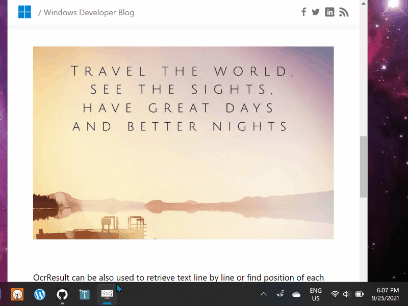
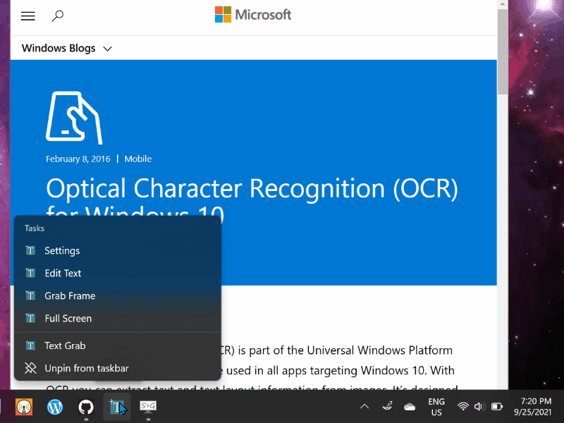

# Text-Grab

This is a minimal Windows utility which makes all visible text available for copy and paste. 

Too often there is text on the screen but it is unable to be selected. This happens when text is saved in an image, in a video, or the text within an application. 

The OCR is done locally by [Windows 10 API](https://docs.microsoft.com/en-us/uwp/api/Windows.Media.Ocr). This enables Text Grab to have essentially no UI and not require a constantly running background process.

## How to Install

### Official

- [Microsoft Store](https://www.microsoft.com/en-us/p/text-grab/9mznkqj7sl0b?cid=TextGrabGitHub)
- [GitHub Releases](https://github.com/TheJoeFin/Text-Grab/releases/latest)

### Community

- [scoop](https://scoop.sh/) — `scoop install text-grab`

## How to Build
Get the code:
- Install git: https://git-scm.com/download/win
- git clone https://github.com/TheJoeFin/Text-Grab.git

### With Visual Studio 2019 or 2022
- Install the Visual Studio (the free community edition is sufficient).
    - Install the "Universal Windows Platform Development" workload.
    - Install the ".NET desktop development" workload.
    - Install ".NET cross-platform development" toolset
    - Install Windows 10 SDK (10.0.19041.0)
- Open `\Text-Grab\Text-Grab.sln` in Visual Studio.
- Set Text-Grab-Package as Startup Project
- Set CPU Target to x86 or x64
- Key F5 or Press "▶ Local Machine"

### With Visual Studio Code (VS Code)
- Install Visual Studio Code https://code.visualstudio.com/
- Install .NET 6.0 SDK https://dotnet.microsoft.com/download/dotnet/6.0
- Open `\Text-Grab\` Folder in VS Code (Same folder as .sln file)
- Key F5 to launch with debugger

## Text Grab works in Three Modes

### 1. Full-Screen Mode

The first full screen use case is the most obvious, selecting a region of the screen and the text within the selected region will be added to the clipboard.

The second use case takes a single click and attempts to copy the word which was clicked on. This is enabled because the Windows 10 OCR API draws a bounding box around each recognized word. 

If the click point or selected region has no text in it the Text Grab window stays active. To exit the application, press the escape key, right-click and choose cancel, or Alt+F4.

### 2. Grab Frame Mode

Grab frame is mostly a transparent frame with a search bar and Grab button. The Grab Frame can be positioned wherever you want to copy the text. This can be done by searching for text, clicking on a word border, and/or clicking on the Grab button.

The underlying OCR technology is the same as the full screen mode and has all of the same benefits and drawbacks. Since Text Grab is using OCR the recognition is not perfect. However, adjusting the size and position of the window does affect the OCR's accuracy.

### 3. Edit Text Window

Similar to Notepad, the Edit Text Window is a "Pure Text" editing experience, with no formatting. This means copying text into or out of the Window will remove all formatting, but linebreaks and tabs will remain. Gather text using Full Screen Grabs or Grab Frames.

There are several tools with in the Edit Text Window which make it quick and easy to fix or change text.
- List files and folders in chosen directory
- Watch clipboard for changes
- Make text into a single line
- Toggle between UPPERCASE, lowercase, and Titlecase
- Trim spaces and empty lines
- Isolate selected text
- Replace reserved characters (like spaces, /, %, etc.)
- Find and replace
- Extract regular expressions
- Remove duplicate lines
- Convert stacked data to table format
- And more!

## Principles
Text Grab is designed to have multiple modes, from minimal to fully featured; all focused on productivity. By using Windows 10’s OCR capabilities Text Grab can launch quickly without needing to run in the background. Pinning Text Grab to the Taskbar enables launching via keyboard shortcut. Now with version 2.4 when the background process is enabled Text Grab can be activated from anywhere using global hotkeys. The full-screen mode is designed to be used hundreds of times a day. Reducing clicks and menus means saving time, which is the primary focus of Text Grab. The Grab Frame tool can be positioned on top of any text content for quick OCR any time. When it comes to manipulating the text you've copied the Edit Text Window offers a wide range of tools to speed up common tasks and take the raw text into clean usable content.

### Thanks for using Text Grab
Hopefully this simple app makes you more productive and saves you time from transcribing text.
If you have any questions or feedback reach out on Twitter [@TheJoeFin](http://www.twitter.com/thejoefin) or by email joe@textgrab.net
