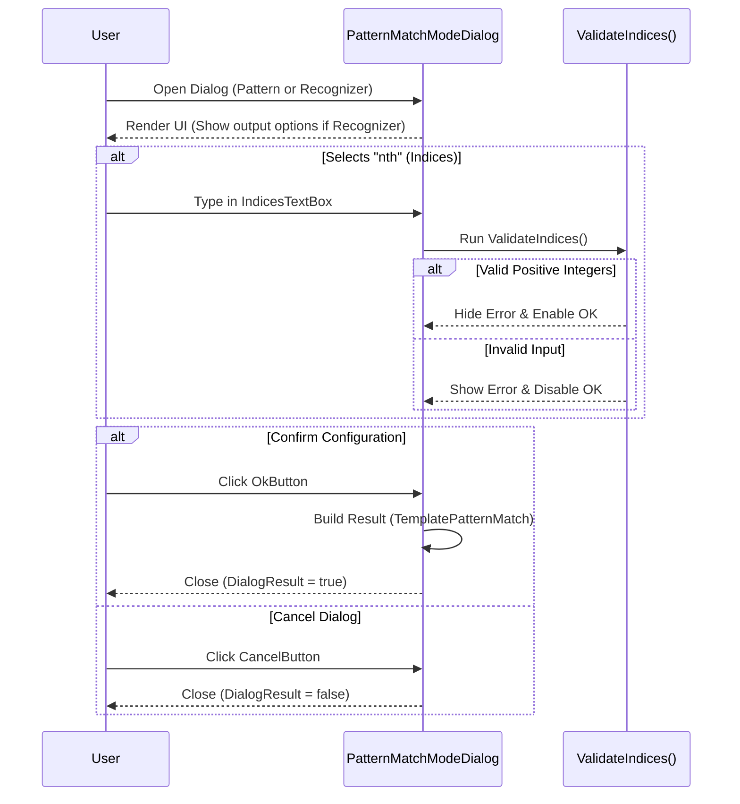

# PatternMatchModeDialog Documentation Guide

**File Path:** `Text-Grab/Controls/PatternMatchModeDialog.xaml.cs`  
**Namespace:** `Text_Grab.Controls`  
**Base Class:** `Wpf.Ui.Controls.FluentWindow`

---

## 1. Overview

The `PatternMatchModeDialog` class is a WPF dialog window (derived from `FluentWindow`) that opens after a user selects a regex pattern or a recognizer from an inline picker. 

It allows the user to configure:
* **Match Mode:** Selection strategy (e.g., first match, last match, all matches, or specific 1-based indices).
* **Separator:** Text separator used when combining multiple match results (active when matching all or specific indices).
* **Output Kind:** (For recognizers only) Choice between outputting the resolved value or the original matched text.

---

## 2. Properties

| Property | Type | Access | Description |
| :--- | :--- | :--- | :--- |
| `Result` | `TemplatePatternMatch?` | `public get; private set;` | Holds the final pattern match configuration upon confirmation. Is `null` if the user cancels or closes the dialog without clicking OK. |
| `SelectedOutputKind` | `RecognizerOutputKind` | `public get; private set;` | Indicates whether output should be `ResolvedValue` or `MatchedText`. Defaults to `RecognizerOutputKind.ResolvedValue`. |

---

## 3. Internal Fields

| Field | Type | Description |
| :--- | :--- | :--- |
| `_patternId` | `string` | Stores the unique identifier for the chosen pattern or recognizer. |
| `_patternName` | `string` | Stores the user-friendly name of the chosen pattern or recognizer. |

---

## 4. Constructors

### `PatternMatchModeDialog(string patternId, string patternName)`
Standard constructor for regular patterns.
* Calls `InitializeComponent()`.
* Assigns `_patternId` and `_patternName`.
* Sets the text of `PatternNameLabel` to `"Pattern: {patternName}"`.

### `PatternMatchModeDialog(string recognizerId, string recognizerName, bool isRecognizer)`
Constructor overload used when configuring recognizers.
* Chains execution to `this(recognizerId, recognizerName)`.
* If `isRecognizer` is `false`, execution terminates after base constructor logic.
* If `isRecognizer` is `true`:
  * Updates window title and `DialogTitleBar.Title` to `"Pattern Match Options"`.
  * Sets `PatternNameLabel.Text` to `"Pattern: {recognizerName}"`.
  * Makes `OutputPanel` visible (`Visibility.Visible`).

---

## 5. UI Event Handlers & Helper Methods

### Event Handlers

#### `MatchModeRadioButton_Checked(object sender, RoutedEventArgs e)`
Handles selection changes among the match mode radio buttons.
* Calls `GetSelectedMode()` to determine the active mode tag.
* Adjusts element visibility:
  * `SeparatorPanel`: Visible if mode is `"all"` or `"nth"`; otherwise collapsed.
  * `IndicesPanel`: Visible if mode is `"nth"`; otherwise collapsed.

#### `IndicesTextBox_TextChanged(object sender, TextChangedEventArgs e)`
Triggers input validation whenever the text in `IndicesTextBox` changes by calling `ValidateIndices()`.

#### `OkButton_Click(object sender, RoutedEventArgs e)`
Executes when the user clicks the OK button:
1. Obtains the current mode from `GetSelectedMode()`.
2. Reads the separator from `SeparatorTextBox.Text`.
3. If mode is `"nth"`:
   * Re-validates indices via `ValidateIndices()`. Cancels submission if invalid.
   * Sets `mode` to the trimmed text of `IndicesTextBox.Text`.
4. Sets `SelectedOutputKind` based on `OutputValueRadio.IsChecked`:
   * `false` $\rightarrow$ `RecognizerOutputKind.MatchedText`
   * `true` $\rightarrow$ `RecognizerOutputKind.ResolvedValue`
5. Constructs a new `TemplatePatternMatch(_patternId, _patternName, mode, separator)` assigned to `Result`.
6. Sets `DialogResult = true` and calls `Close()`.

#### `CancelButton_Click(object sender, RoutedEventArgs e)`
Sets `DialogResult = false` and closes the dialog window without generating a `Result`.

---

### UI State and Validation Helpers

#### `GetSelectedMode()`
* **Returns:** `string` (e.g., `"first"`, `"last"`, `"all"`, or `"nth"`).
* Scans `MatchModePanel` child controls for a `RadioButton` where `IsChecked == true`.
* Reads the button's `Tag` property. Defaults to `"first"` if no tag or button is checked.

#### `ValidateIndices()`
* **Returns:** `bool` (`true` if valid, `false` if invalid).
* Validates `IndicesTextBox.Text`:
  * **Empty check:** Fails if empty or whitespace $\rightarrow$ Error: *"At least one index is required."*
  * **Comma-splitting:** Splits text by `,` ignoring empty entries and whitespace.
  * **Positive integer check:** Enforces that every token converts to an integer $\ge 1$. If invalid $\rightarrow$ Error: *"\"{part}\" is not a valid positive integer."*
* Calls `HideIndicesError()` and returns `true` if all validations pass.

#### `ShowIndicesError(string message)`
* Displays `IndicesErrorText` with the provided message string.
* Disables `OkButton` (`IsEnabled = false`).

#### `HideIndicesError()`
* Hides `IndicesErrorText` (`Visibility.Collapsed`).
* Enables `OkButton` (`IsEnabled = true`).

---

## 6. Execution Flow Summary

